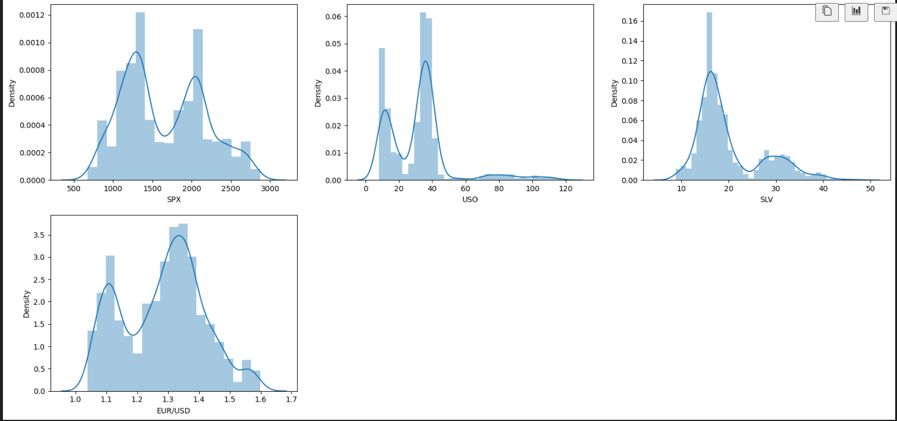
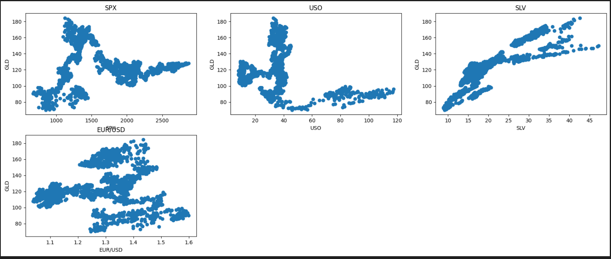
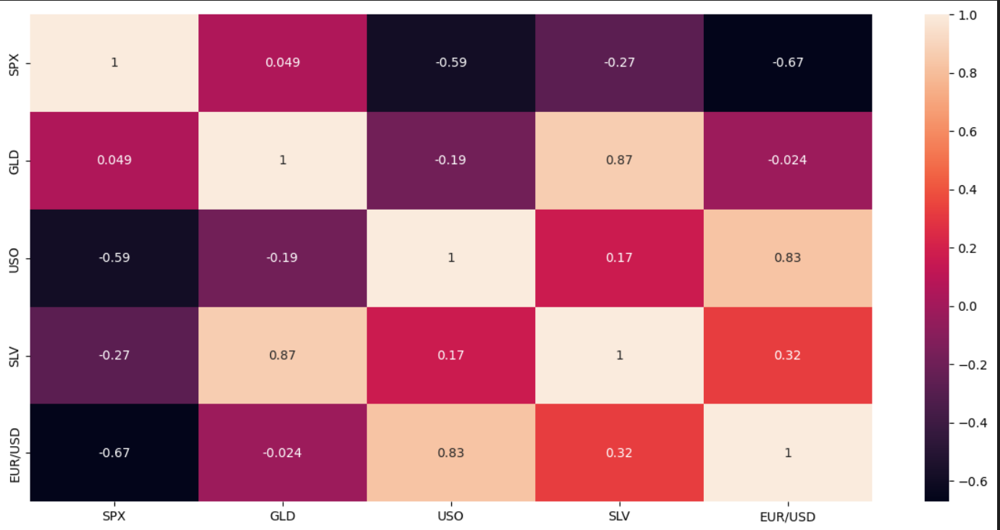
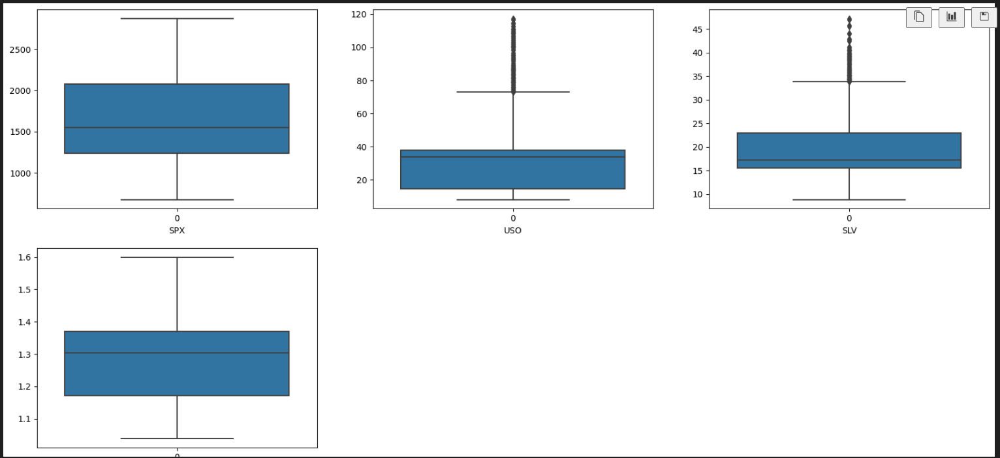

# Gold Price Prediction

This project focuses on predicting the gold price using time series analysis. The dataset used for this project is obtained from Kaggle.

## Dataset

The dataset used in this project consists of 2290 entries with the following columns:

- Date: The date of the observation (categorical)
- SPX: The value of the SPX index (numerical)
- GLD: The gold price (numerical)
- USO: The value of the USO index (numerical)
- SLV: The value of the SLV index (numerical)
- EUR/USD: The exchange rate between EUR and USD (numerical)

## Exploratory Data Analysis (EDA)

During the exploratory data analysis phase, several important steps were taken to understand the dataset:

1. Identification of Unwanted Columns: The dataset was analyzed to identify any unwanted columns that may not contribute to the gold price prediction. However, it was determined that all columns are relevant to the analysis.

2. Handling Missing Values: The dataset was checked for missing values, and it was found that there are no missing values in any of the columns.

3. Identification of Features with One Value: The dataset was examined to identify features that have only one unique value. Fortunately, there were no columns with only one value, ensuring that all features provide useful information.

4. Exploration of Categorical Features: The categorical feature, "Date," was analyzed to understand its distribution and potential impact on the gold price. Visualizations and statistical summaries were generated to gain insights into the relationship between the date and gold price.

5. Exploration of Numerical Features: The four numerical features (SPX, GLD, USO, and SLV) were explored to understand their distributions, central tendencies, and variations. Descriptive statistics, histograms, and density plots were generated to visualize the data.

6. Identification of Discrete Numerical Features: The dataset was inspected to identify any discrete numerical features. However, no discrete features were found in the dataset.

7. Identification of Continuous Numerical Features: The four numerical features were classified as continuous numerical features. This distinction helps determine appropriate analytical techniques and visualizations.

8. Distribution of Continuous Numerical Features: Visualizations, such as histograms and density plots, were created to understand the distributions of SPX, GLD, USO, and SLV. It was observed that SPX, SLV, and EUR/USD follow a normal distribution, while USO is heavily skewed to the right.

9. Key Takeaways from the Distribution Analysis: Based on the distribution analysis, it was concluded that SPX, SLV, and EUR/USD exhibit normal distributions, which can be useful for certain modeling techniques. On the other hand, USO's distribution is skewed, indicating a potential presence of outliers.

10. Relationship between Continuous Numerical Features and Labels: The relationship between each continuous numerical feature and the gold price (GLD) was examined. Scatter plots and correlation matrices were generated to visualize the relationships. It was observed that SLV has a linear relationship with GLD, suggesting a potential predictive power.

11. Identification of Outliers in Numerical Features: Outliers were detected in the USO and SLV features. Outliers are extreme values that deviate significantly from the majority of the data points. Identifying and handling outliers is crucial to prevent them from unduly influencing the predictive models.

12. Exploration of the Correlation between Numerical Features: A correlation matrix was generated to quantify the relationships between the numerical features. The matrix revealed that the SLV feature is highly correlated with the gold price (GLD), indicating a strong association between the two variables.

## Feature Engineering

Feature engineering is a crucial step in preparing the data for modeling. In this project, the

 following steps were performed:

1. Dropping Unwanted Features: After conducting the exploratory data analysis, it was determined that no unwanted columns exist in the dataset. Therefore, no features were dropped during this step.

2. Handling Missing Values: The dataset was already verified to have no missing values. Hence, no additional steps were required for handling missing values.

3. Handling Categorical Features: If any categorical features were present, appropriate encoding or transformation techniques would be applied in this step. However, since the only categorical feature in the dataset is the "Date" column, which was not used as a predictor, no further actions were taken.

4. Handling Feature Scaling: Feature scaling techniques, such as normalization or standardization, are commonly applied to ensure that all features are on a similar scale. However, since the numerical features in the dataset were already in a comparable range, no scaling was performed.

5. Removing Outliers: Outliers detected in the USO and SLV features during the EDA phase were removed to prevent their adverse effects on the predictive models. Removing outliers can enhance the accuracy and robustness of the models.

## Splitting the Dataset

To assess the performance of the predictive models, the dataset was divided into a training set and a test set. The training set was used to train the models, while the test set was used to evaluate their performance. Proper separation of the data ensures that the models are assessed on unseen data, enabling a more accurate estimation of their real-world performance.

## Model Selection

Three regression models were considered for gold price prediction: Decision Tree Regressor, XGBRegressor, and Random Forest Regressor. To determine the best model, a grid search approach was employed. The grid search involved evaluating different combinations of hyperparameters for each model and selecting the one with the best performance.

The following table summarizes the results of the grid search:

|       Model              |   Best Score  | Best Parameters                                                    |
|--------------------------|---------------|-------------------------------------------------------------------|
|   Decision Tree Regressor|   0.981076    | {'criterion': 'friedman_mse', 'splitter': 'best'}                 |
|   Random Forest Regressor|   0.911328    | {'criterion': 'friedman_mse', 'max_depth': 3, 'max_features': 'log2', 'n_estimators': 130}|
|   XGBRegressor           |   0.984461    | {'learning_rate': 0.5, 'max_depth': 3, 'n_estimators': 200}       |

The performance of each model was evaluated using cross-validation with a ShuffleSplit of 5 splits and a test size of 20%. The model with the best score and corresponding hyperparameters was selected as the best model.

## Model Building Using XGB Regressor

Based on the results obtained from the grid search, the XGBRegressor model was chosen as the best model for gold price prediction. The XGBRegressor is a powerful gradient boosting algorithm that combines multiple weak learners to create a strong predictive model.

The XGBRegressor model achieved a best score of 0.9875798991169574, indicating its ability to accurately predict the gold price based on the available features.

The complete implementation details, code, and additional analysis can be found in the corresponding Jupyter Notebook or script files.

